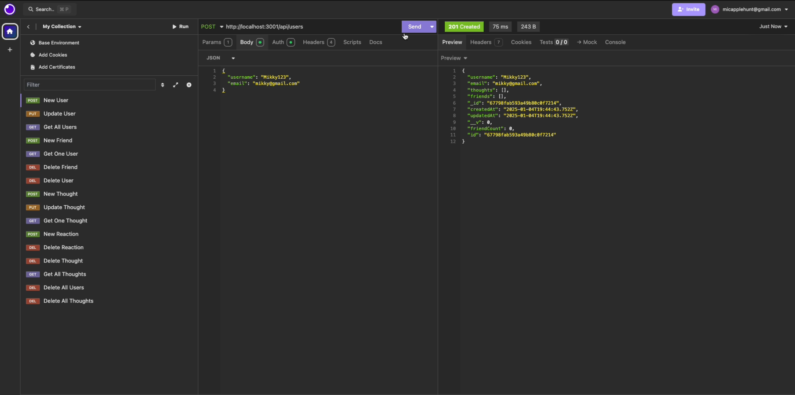

# Chatty Kathy
  

  ## Description

  This project is a logic-only social media program. It allows the user to create users, establish friendships between users, create posts called 'thoughts', and add reactions to those posts.

  ## Table of Contents

  - [Installation](#installation)
  - [Screenshot](#screenshot)
  - [Walkthough Video](#walkthrough-video)
  - [Usage](#usage)
  - [Credits](#credits)  
  - [License](#license)
  - [Features](#features)

  ## Screenshot

  

  ## Walkthrough Video

  Here is a link to the walkthrough video!
  https://drive.google.com/file/d/1UA9H5cQUzP_vAIcA2EYTp9KT9etC3goD/view?usp=drive_link

  ## Installation

  Download the project, then run "npm i && npm run build".

  ## Usage

  To run the project, open the terminal and run "npm start". Then, you can run requests using programs like Insomnia or Postman. The request paths are commented in userRoutes.ts and thoughtRoutes.ts!

  ## Credits

  Packages:
  - Express
  - Mongoose
  - Typescript
  Other: 
  - edX's project: "28-Stu_Mini-Proj" under 17-NoSQL folder

  ## License

  This project is protected under the MIT license.

  ## Features

  Manage users:
  - Create user(s)
  - Update user email or username
  - View all or just one user
  - Delete user(s)
  - Add another user as a friend
  - Remove another user as a friend
  Manage thoughts:
  - Create thought(s)
  - Update thought
  - View all or just one thought
  - Delete thought(s)
  - Add reaction to a thought
  - Remove reaction to a thought

  ## Still have questions? 

  My profile: https://github.com/MichaelaHunt  
  Please direct any questions to micapplehunt@gmail.com!
